# 🧊 Ледяные человечки (Iceberg People)

Выживание на тающем айсберге — одиночный HTML-файл, canvas-игра на чистом JS.
Вместе с игрой — **Пресс-Центр**: 100 статей, каталог 120 выпусков по месяцам 2026–2027,
12 PDF-журналов (240 тщательных листов: у каждого номера афиша + лист рубрик), 120 обложек PNG,
заметки и зарисовки про сковородки и Бабая — везде.

## Как играть
- **Клик по льду** — морозный заряд: восстанавливает айсберг (тратит ману).
- **Клик по воде** — ловля рыбы для прокорма племени.

Айсберг постоянно тает, и таяние ускоряется с ростом населения. Рыба нужна
людям; при запасе ≥25 рождается новый человечек, голод убивает. Периодически
налетают штормы с усиленным таянием. Продержись как можно дольше и побей рекорд!
У людей — имена, у лагеря — **Летопись** (📜 под игрой) и **Хроника эпохи**
в финале: маленькая жизнь, которая стоит большой истории.

## Запуск
Просто открой `index.html` в браузере. Сохранение рекорда — через localStorage.
Витрина всего контента: **[press-center.html](press-center.html)**.
Смотри также:
- **[🗞 Газетный киоск](kiosk.html)** — все 120 обложек по 12 сериям, с зарисовками про сковородки и Бабая;
- **[📖 Энциклопедия Льда](wiki-ice.html)** — движок, серии, герои, 100 статей, инженерные выкладки, рецепты;
- **[🎭 Досье героев](heroes.html)** — 120 шаржей серийных героев и их арки судеб;
- **[🎪 Забавный уголок](fun.html)** — гороскоп Сковородного Оракула, загадки, объявления, письма читателей, приметы.

Идея: папка `Projects` содержит прототип `iceberg-people.html`.

## 📰 Пресс-Центр «Ледяной Пресс-Центр»

| | Журнал | Выпуски | Файл |
|---|---|---|---|
| 📰 | **Ледяная Площадь** — металописье деревни | 01–10 | [PDF](journals_pdf/journal-01-ledyanaya-ploshchad-01-10.pdf) |
| 🔮 | **Шапка и Клик** — приёмы и тактики | 01–10 | [PDF](journals_pdf/journal-02-shapka-i-klik-01-10.pdf) |
| 📊 | **Баланс-Вестник** — числа и алгоритмы | 01–10 | [PDF](journals_pdf/journal-03-balans-vestnik-01-10.pdf) |
| 🌩 | **Шторм-Таймс** — хроника бурь | 01–10 | [PDF](journals_pdf/journal-04-shtorm-tayms-01-10.pdf) |
| 👥 | **Племя-Курьер** — судьбы героев | 01–10 | [PDF](journals_pdf/journal-05-plemya-kurer-01-10.pdf) |
| 🔭 | **Айсберг-Future** — футурология | 01–10 | [PDF](journals_pdf/journal-06-aysberg-future-01-10.pdf) |
| 🖥 | **Мана-Газетка** — технологии льда | 01–10 | [PDF](journals_pdf/journal-07-mana-gazetka-01-10.pdf) |
| 🏆 | **Рекорд-Пресс** — турниры и лиги | 01–10 | [PDF](journals_pdf/journal-08-rekord-press-01-10.pdf) |
| 🕯 | **Вечный Лёд** — притчи | 01–10 | [PDF](journals_pdf/journal-09-vechnyy-led-01-10.pdf) |
| 🪐 | **Галактика Айсберг** — космос будущего | 01–10 | [PDF](journals_pdf/journal-10-galaktika-aysberg-01-10.pdf) |
| ✨ | **Ледяной Глянец** — мода севера (глянцевый) | 01–10 | [PDF](journals_pdf/journal-11-ledyanoy-glyanets-01-10-glossy.pdf) |
| 🌊 | **Северная Волна** — светская хроника (глянцевый) | 01–10 | [PDF](journals_pdf/journal-12-severnaya-volna-01-10-glossy.pdf) |

## 🖼 Обложки журналов

<p align="center">
  <a href="journals_pdf/journal-01-ledyanaya-ploshchad-01-10.pdf">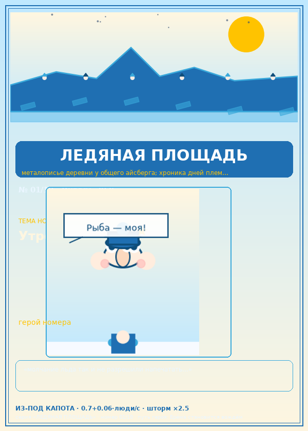</a>
  <a href="journals_pdf/journal-02-shapka-i-klik-01-10.pdf">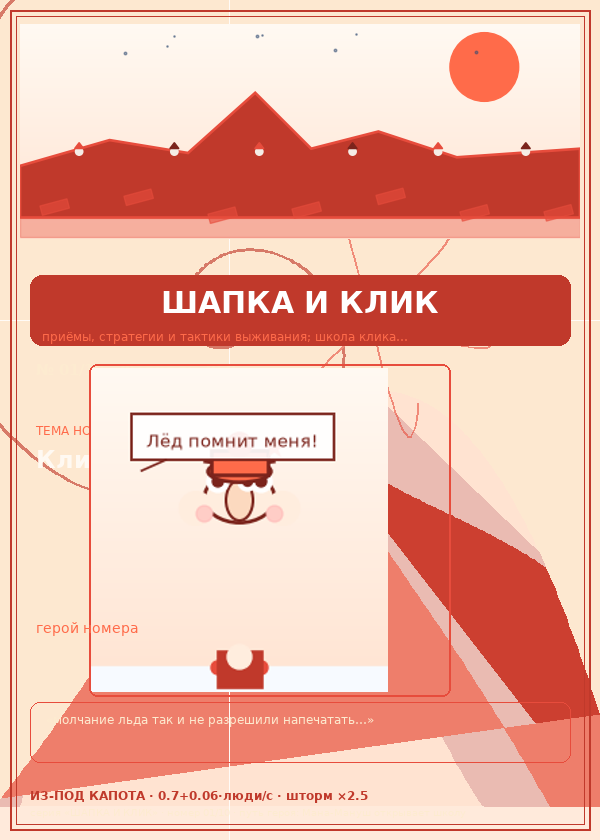</a>
  <a href="journals_pdf/journal-03-balans-vestnik-01-10.pdf">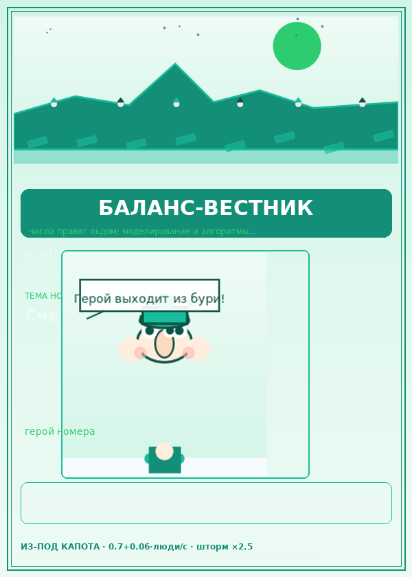</a>
  <a href="journals_pdf/journal-04-shtorm-tayms-01-10.pdf">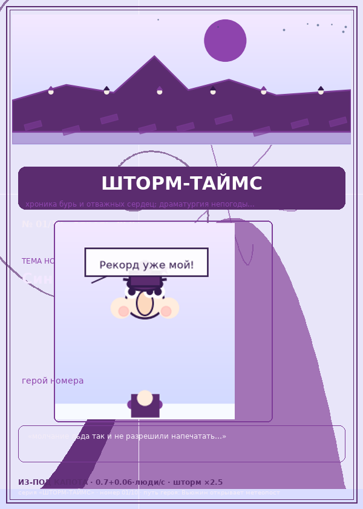</a>
</p>
<p align="center">
  <a href="journals_pdf/journal-05-plemya-kurer-01-10.pdf">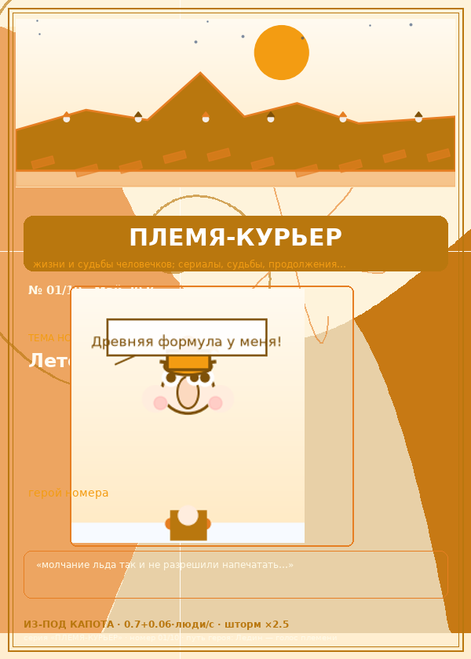</a>
  <a href="journals_pdf/journal-06-aysberg-future-01-10.pdf">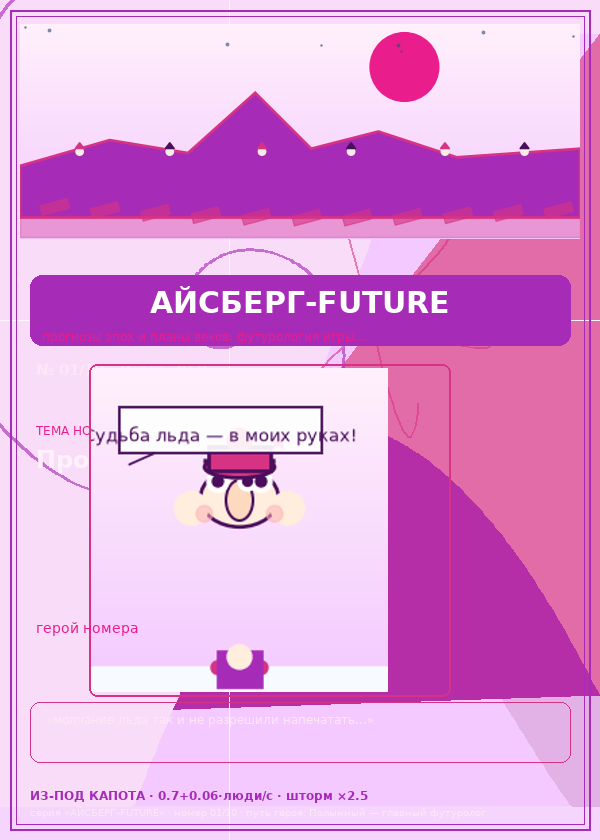</a>
  <a href="journals_pdf/journal-07-mana-gazetka-01-10.pdf">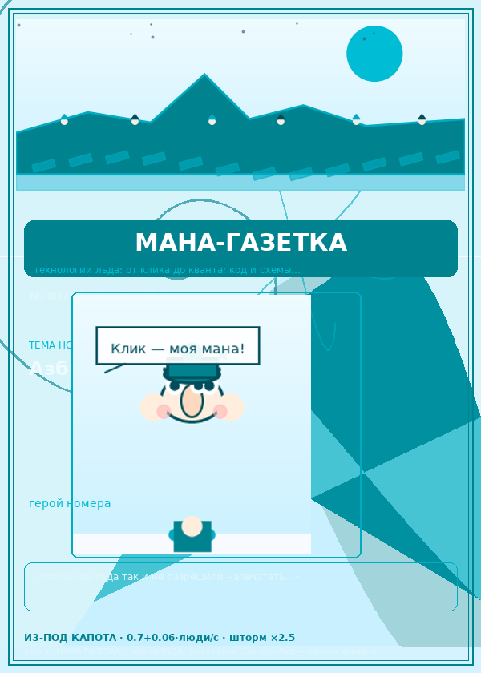</a>
  <a href="journals_pdf/journal-08-rekord-press-01-10.pdf">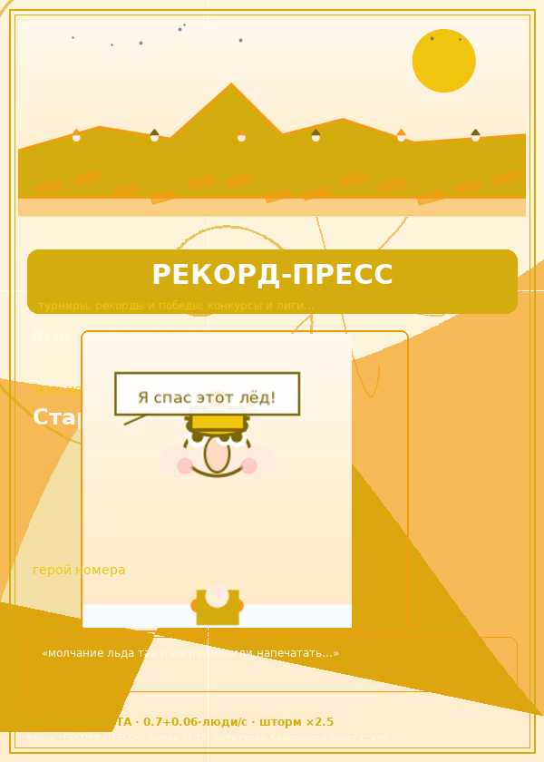</a>
</p>
<p align="center">
  <a href="journals_pdf/journal-09-vechnyy-led-01-10.pdf">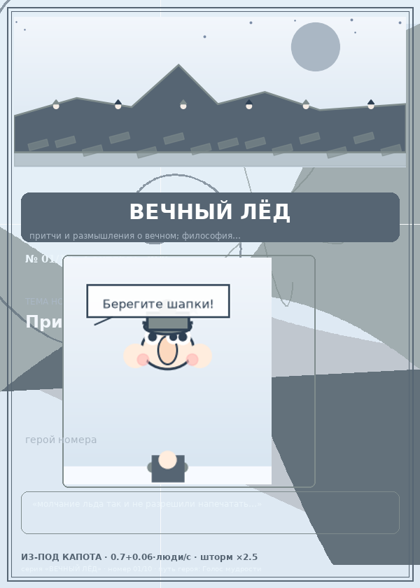</a>
  <a href="journals_pdf/journal-10-galaktika-aysberg-01-10.pdf">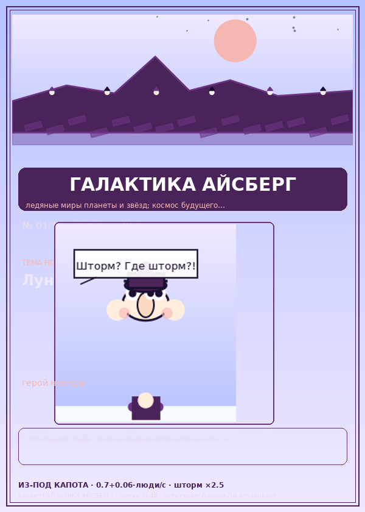</a>
  <a href="journals_pdf/journal-11-ledyanoy-glyanets-01-10-glossy.pdf">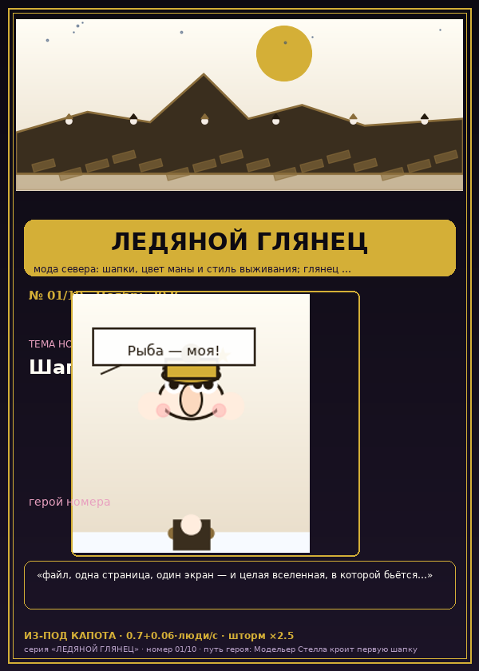</a>
  <a href="journals_pdf/journal-12-severnaya-volna-01-10-glossy.pdf">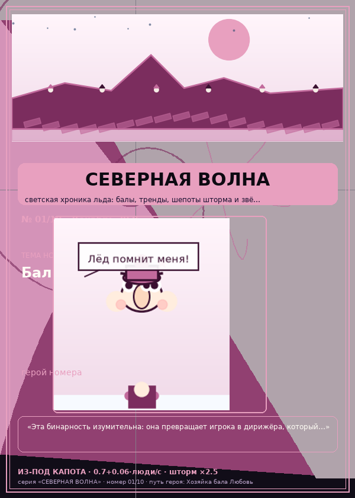</a>
</p>

## 📄 Контент
- **50 статей-анализов** — `articles/01-shedevr.txt … 50-itog.txt`.
- **50 статей о будущем** («Ледяная Вечерка») — `articles/future/`.
- **Каталог по месяцам** — `journals/2026-01 … 2027-09`, 120 выпусков по датам.

## ⚙️ Из-под капота (реальный движок `index.html`)
- таяние: `0.7 + 0.06·люди` %/с, шторм ×2.5 на 10с (каждые 50–70с);
- мана: +8/с (макс 100), заряд −3 маны → +2.5% льда;
- рыба: +6 за клик (кулдаун 0.4с), естественная убыль −0.3·люди/с;
- рождение: рыба ≥25 → +1 человек каждые 6с (−15 рыбы); голод: 3с без рыбы → −1;
- предел племени 12; счёт = время×10 + люди×50.

## 🔧 Пересборка
```bash
python gen_pdf_journals.py   # 12 PDF-журналов (240 страниц)
python gen_covers.py         # обложки PNG → covers/
python gen_press_center.py   # press-center.html заново
python gen_kiosk.py          # kiosk.html — все 120 обложек + зарисовки
python gen_wiki.py           # wiki-ice.html — энциклопедия
python gen_heroes.py         # heroes.html — 120 шаржей героев
python gen_fun.py            # fun.html — забавный уголок
```