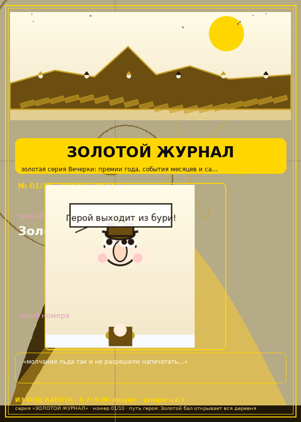

# 🧊 Ледяные человечки (Iceberg People)

Выживание на тающем айсберге — одиночный HTML-файл, canvas-игра на чистом JS.
Вместе с игрой — **Пресс-Центр**: 100 статей, каталог 130 выпусков по месяцам 2026–2028,
15 PDF-изданий (500 страниц): 13 серий журналов по 10 выпусков (у каждого номера афиша +
журнальный лист рубрик с табло реальной партии движка, шаржем героя, карикатурой месяца
и рубриками; у Золотого журнала — ещё лист событий и закулисья) плюс «Айс-График» —
журнал графиков: 10 томов по 20 страниц, где 80% — крупные схемы и кубы, а 20% — текст;
плюс «Проектная работа» — 30 листов о самом репозитории: структура git, подходы, «по науке»;
листы без схем — полевые страницы с разлиновкой и уголком эскиза для заметок и рисунков в дороге;
в центре — проектируемый модуль «Айс-генератор айсбергов» (силуэты из шума, экспорт JSON);
130 обложек PNG, заметки и зарисовки про сковородки и Бабая — везде.

Иллюстрации — по жанрам: **шарж** (портрет героя, информационно-разъяснительно: кто и каков,
узнаваем между выпусками) и **карикатура** (сценка месяца, воспитательно: событие партии по коду
игра + мораль из приёма номера). Шарж объясняет героя, карикатура воспитывает играющего.

## Как играть
- **Клик по льду** — морозный заряд: восстанавливает айсберг (тратит ману).
- **Клик по воде** — ловля рыбы для прокорма племени.

Айсберг постоянно тает, и таяние ускоряется с ростом населения. Рыба нужна
людям; при запасе ≥25 рождается новый человечек, голод убивает. Периодически
налетают штормы с усиленным таянием. Продержись как можно дольше и побей рекорд!
У людей — имена, у лагеря — **Летопись** (📜 под игрой) и **Хроника эпохи**
в финале: маленькая жизнь, которая стоит большой истории.

## Запуск
Просто открой `index.html` в браузере. Сохранение рекорда — через localStorage.
Витрина всего контента: **[press-center.html](press-center.html)**.
Смотри также:
- **[🗞 Газетный киоск](kiosk.html)** — все 130 обложек по 13 сериям, с зарисовками про сковородки и Бабая;
- **[📖 Энциклопедия Льда](wiki-ice.html)** — движок, серии, герои, 100 статей, инженерные выкладки, рецепты;
- **[🎭 Досье героев](heroes.html)** — 130 шаржей серийных героев и их арки судеб;
- **[🎪 Забавный уголок](fun.html)** — гороскоп Сковородного Оракула, загадки, объявления, письма читателей, приметы;
- **[📅 Лента эпох](epochs.html)** — 31 месяц жизни лагеря, выпуски по датам;
- **[✨ Полиарт-φ](polyart.html)** — 130 обложек в фирменном стиле: полиномиальные слои, золотое сечение, кристаллы;
- **[🖼 Ситуация — иллюстрация](situations.html)** — 78 полиарт-зарисовок: каждое событие лагеря отвечает картиной.

Идея: папка `Projects` содержит прототип `iceberg-people.html`.

## 📰 Пресс-Центр «Ледяной Пресс-Центр»

| | Журнал | Выпуски | Файл |
|---|---|---|---|
| 📰 | **Ледяная Площадь** — металописье деревни | 01–10 | [PDF](journals_pdf/journal-01-ledyanaya-ploshchad-01-10.pdf) |
| 🔮 | **Шапка и Клик** — приёмы и тактики | 01–10 | [PDF](journals_pdf/journal-02-shapka-i-klik-01-10.pdf) |
| 📊 | **Баланс-Вестник** — числа и алгоритмы | 01–10 | [PDF](journals_pdf/journal-03-balans-vestnik-01-10.pdf) |
| 🌩 | **Шторм-Таймс** — хроника бурь | 01–10 | [PDF](journals_pdf/journal-04-shtorm-tayms-01-10.pdf) |
| 👥 | **Племя-Курьер** — судьбы героев | 01–10 | [PDF](journals_pdf/journal-05-plemya-kurer-01-10.pdf) |
| 🔭 | **Айсберг-Future** — футурология | 01–10 | [PDF](journals_pdf/journal-06-aysberg-future-01-10.pdf) |
| 🖥 | **Мана-Газетка** — технологии льда | 01–10 | [PDF](journals_pdf/journal-07-mana-gazetka-01-10.pdf) |
| 🏆 | **Рекорд-Пресс** — турниры и лиги | 01–10 | [PDF](journals_pdf/journal-08-rekord-press-01-10.pdf) |
| 🕯 | **Вечный Лёд** — притчи | 01–10 | [PDF](journals_pdf/journal-09-vechnyy-led-01-10.pdf) |
| 🪐 | **Галактика Айсберг** — космос будущего | 01–10 | [PDF](journals_pdf/journal-10-galaktika-aysberg-01-10.pdf) |
| ✨ | **Ледяной Глянец** — мода севера (глянцевый) | 01–10 | [PDF](journals_pdf/journal-11-ledyanoy-glyanets-01-10-glossy.pdf) |
| 🌊 | **Северная Волна** — светская хроника (глянцевый) | 01–10 | [PDF](journals_pdf/journal-12-severnaya-volna-01-10-glossy.pdf) |
| 🏆 | **Золотой Журнал** — события и премии года (золотая серия, 30 листов) | 01–10 | [PDF](journals_pdf/journal-13-zolotoy-zhurnal-01-10-golden.pdf) |
| 📈 | **Айс-График** — журнал графиков: 80% крупных схем и кубов, 20% текста (10 томов × 20 страниц) | 200 | [PDF](journals_pdf/ajs-grafik-01-10.pdf) |
| 🎓 | **Проектная работа** — журнал о репозитории: структура git, подходы, «по науке»; листы без схем — полевые (для заметок и эскизов в дороге); план модуля «Айс-генератор айсбергов» (1 выпуск) | 30 | [PDF](journals_pdf/proektnaya-rabota.pdf) |

## 🖼 Обложки журналов

<p align="center">
  <a href="journals_pdf/journal-01-ledyanaya-ploshchad-01-10.pdf"></a>
  <a href="journals_pdf/journal-02-shapka-i-klik-01-10.pdf"></a>
  <a href="journals_pdf/journal-03-balans-vestnik-01-10.pdf"></a>
  <a href="journals_pdf/journal-04-shtorm-tayms-01-10.pdf"></a>
</p>
<p align="center">
  <a href="journals_pdf/journal-05-plemya-kurer-01-10.pdf"></a>
  <a href="journals_pdf/journal-06-aysberg-future-01-10.pdf"></a>
  <a href="journals_pdf/journal-07-mana-gazetka-01-10.pdf"></a>
  <a href="journals_pdf/journal-08-rekord-press-01-10.pdf"></a>
</p>
<p align="center">
  <a href="journals_pdf/journal-09-vechnyy-led-01-10.pdf"></a>
  <a href="journals_pdf/journal-10-galaktika-aysberg-01-10.pdf"></a>
  <a href="journals_pdf/journal-11-ledyanoy-glyanets-01-10-glossy.pdf"></a>
  <a href="journals_pdf/journal-12-severnaya-volna-01-10-glossy.pdf"></a>
  <a href="journals_pdf/journal-13-zolotoy-zhurnal-01-10-golden.pdf"></a>
</p>

## 📄 Контент
- **50 статей-анализов** — `articles/01-shedevr.txt … 50-itog.txt`.
- **50 статей о будущем** («Ледяная Вечерка») — `articles/future/`.
- **Каталог по месяцам** — `journals/2026-01 … 2028-07`, 130 выпусков по датам.
- **Золотой журнал** (серия 13, 2027-10…2028-07) — событийные выпуски: главное событие и шесть происшествий месяца.

## ⚙️ Из-под капота (реальный движок `index.html`)
- таяние: `0.7 + 0.06·люди` %/с, шторм ×2.5 на 10с (каждые 50–70с);
- мана: +8/с (макс 100), заряд −3 маны → +2.5% льда;
- рыба: +6 за клик (кулдаун 0.4с), естественная убыль −0.3·люди/с;
- рождение: рыба ≥25 → +1 человек каждые 6с (−15 рыбы); голод: 3с без рыбы → −1;
- предел племени 12; счёт = время×10 + люди×50.

## 🔧 Пересборка
```bash
python gen_journal_catalog.py # txt-выпуски всех 13 серий по месяцам (каталог)
python gen_pdf_journals.py   # 13 PDF-журналов (270 страниц: 12×20 + золотой×30)
python gen_ajs_grafik.py     # «Айс-График» — 10 томов × 20 страниц графиков и кубов (200)
python gen_project_work.py   # «Проектная работа» — 30 листов: git, подходы, Айс-генератор
python gen_covers.py         # обложки PNG → covers/ (130 шт)
python gen_press_center.py   # press-center.html заново (цифры считаются из файлов)
python gen_kiosk.py          # kiosk.html — все 130 обложек + зарисовки
python gen_wiki.py           # wiki-ice.html — энциклопедия
python gen_heroes.py         # heroes.html — 130 шаржей героев
python gen_fun.py            # fun.html — забавный уголок
python gen_epochs.py         # epochs.html — лента эпох (31 месяц)
python gen_polyart.py        # polyart.html — полиарт-галерея обложек
python gen_situations.py     # situations/ + situations.html — 78 зарисовок событий
```
> Все числа на витринах (журналы, страницы, обложки, шаржи, месяцы) вычисляются из
> реальных файлов и статей — статистика не устаревает при добавлении новых серий.